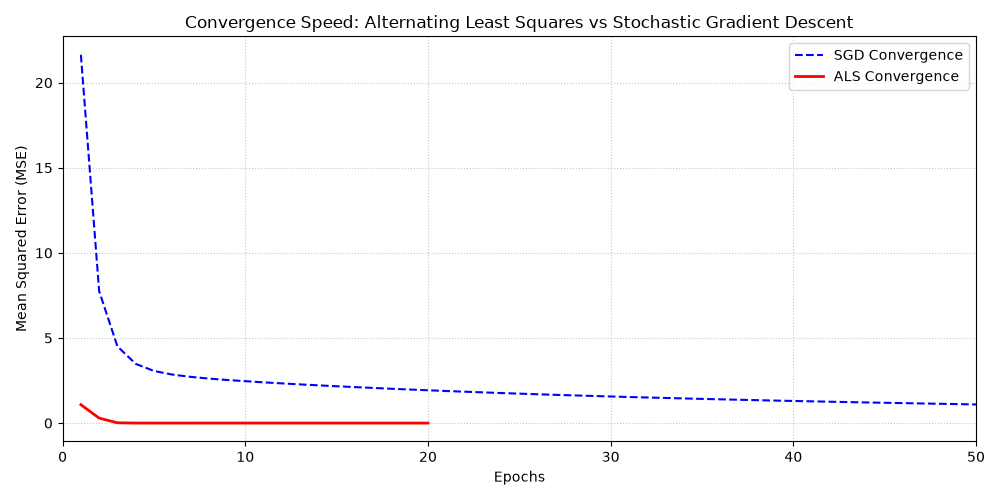

# 📉 Empirical Benchmark of Matrix Factorization: ALS vs. SGD


## 📌 Abstract
This repository provides a from-scratch, dependency-free (NumPy-only) implementation and mathematical benchmark of two fundamental optimization algorithms used in Collaborative Filtering and Recommender Systems: **Stochastic Gradient Descent (SGD)** and **Alternating Least Squares (ALS)**. 

The primary goal of this project is not just to build a recommender system, but to demonstrate a deep theoretical understanding of **non-convex optimization**, **numerical stability**, and **convergence behavior** in sparse matrices.

## 🧮 Mathematical Foundation & Approach

The core problem of Matrix Factorization is to decompose a sparse User-Item rating matrix $R$ into two lower-dimensional latent matrices, $P$ (Users) and $Q$ (Items). The objective function is highly **non-convex** when optimized simultaneously:

$$\min_{P,Q} \sum_{(u,i) \in \mathcal{K}} (r_{ui} - p_u^T q_i)^2 + \lambda (\|p_u\|^2 + \|q_i\|^2)$$

### 1. The ALS Approach (Convex Relaxation)
Solving $P$ and $Q$ simultaneously is computationally intractable. The **Alternating Least Squares** method bypasses this by freezing one matrix to make the objective function strictly **convex** with respect to the other matrix. 

Instead of using direct matrix inversion $O(n^3)$ which is prone to floating-point errors, this implementation uses `np.linalg.solve` to solve the resulting linear system $Ax = b$ efficiently:
$$p_u = (Q^T Q + \lambda I)^{-1} Q^T r_u \implies (Q^T Q + \lambda I) p_u = Q^T r_u$$
* **Key advantage:** Exceptional numerical stability and extremely fast convergence (typically within 10-20 epochs).

### 2. The SGD Approach
While ALS takes large, computationally heavy steps, **Stochastic Gradient Descent** iteratively updates the latent vectors using the gradient of the error. Relying on the Robbins-Monro condition, the algorithm updates the parameters point-by-point:
$$p_u \leftarrow p_u + \gamma (e_{ui} q_i - \lambda p_u)$$
* **Key advantage:** Linear time complexity per epoch $O(|\mathcal{K}| \cdot f)$, making it highly scalable, though requiring significantly more epochs to converge.

## 🚀 Key Engineering Features
- **Zero High-Level Frameworks:** Built entirely from scratch using mathematical primitives to demonstrate algorithmic transparency.
- **Sparse Matrix Processing:** Algorithms are strictly optimized to iterate only over observed interactions (`R_ui != 0`), avoiding massive dense matrix computations.
- **L2 Regularization ($\lambda$):** Implemented penalty terms to prevent overfitting and singular matrix errors during ALS resolution.
- **Numerical Stability:** Strategic use of linear equation solvers (`np.linalg.solve`) instead of naïve inverse calculations (`np.linalg.inv`).

## 📊 Benchmark Results: Convergence Speed

Running the benchmark visualizes the dramatic difference in the optimization path:

<p align="center">
  
</p>

**Observation:** ALS demonstrates a steep, immediate drop in Mean Squared Error (MSE), converging in less than 15 epochs by taking geometrically optimal steps. In contrast, SGD requires hundreds of epochs to reach the same local minimum, navigating the loss landscape via unbiased stochastic gradients.

## 💻 Quick Start

To run the benchmark and generate the comparative plot on your local machine:

```bash
git clone https://github.com/MohammadBidkhori/Matrix-Factorization-Benchmark.git
cd Matrix-Factorization-Benchmark
pip install numpy matplotlib
python benchmark.py
```
